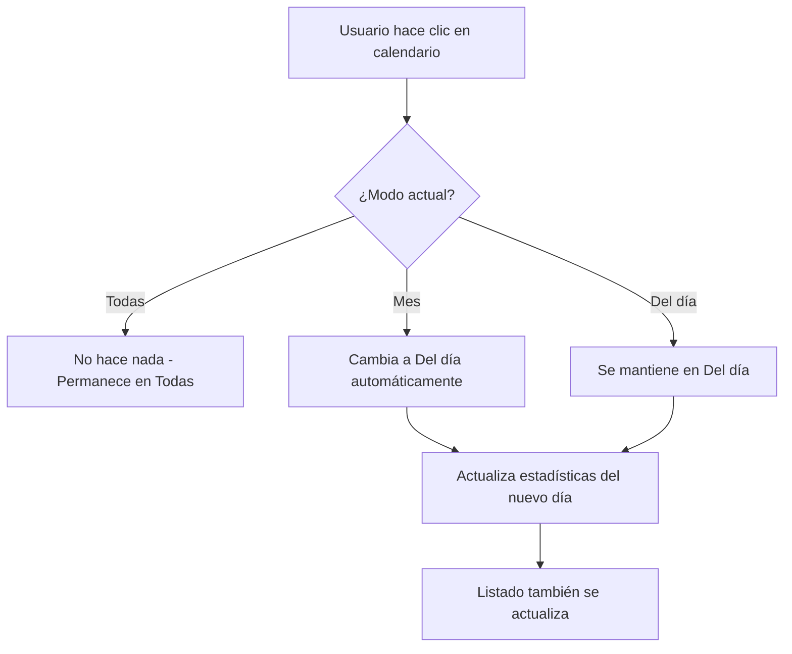

# ✅ Actualización Completada - Estadísticas V2.0

## 🎯 Problema Resuelto

**Antes:**
> "Cuando hago clic en un día del calendario no cambian las estadísticas, solo cambia el listado"

**Ahora:**
> ✅ Las estadísticas se sincronizan automáticamente con el calendario
> ✅ Se agregó modo "Mes" para ver estadísticas mensuales
> ✅ Toggle de 3 opciones: "Todas" | "Mes" | "Del día"

---

## 🆕 Cambios Implementados

### 1. Toggle Mejorado (3 Opciones)

```
┌─────────────────────────────────────────┐
│  [Todas]  [Mes]  [Del día] ←── Toggle  │
└─────────────────────────────────────────┘
```

**Opciones:**

| Modo | Descripción | Icono |
|------|-------------|-------|
| **Todas** | Muestra todas las reservas según filtros | 🗂️ |
| **Mes** | Muestra reservas del mes seleccionado | 📆 |
| **Del día** | Muestra reservas del día seleccionado | 📅 |

---

### 2. Sincronización Automática

**Comportamiento:**
```javascript
// Al hacer clic en el calendario:
Usuario selecciona "Martes 10 de octubre"
  ↓
Las estadísticas cambian automáticamente a "Del día"
  ↓
Muestran solo las reservas del martes 10
```

**Excepción:**
- Si estás en modo "Todas", NO cambia automáticamente
- Esto permite analizar el panorama general sin interrupciones

---

### 3. Nueva Función: Filtrado por Mes

**Archivo:** `src/utils/statsHelper.js`

```javascript
export const filterReservationsByMonth = (reservations, selectedDate) => {
    // Filtra reservas del mismo mes y año
    const selectedMonth = selectedDate.getMonth();
    const selectedYear = selectedDate.getFullYear();
    
    return reservations.filter(reservation => {
        const reservationDate = new Date(reservation.start || reservation.hora_inicio);
        return reservationDate.getMonth() === selectedMonth && 
               reservationDate.getFullYear() === selectedYear;
    });
};
```

---

## 📊 Casos de Uso

### Caso 1: Análisis del Mes Actual
```
1. Haz clic en cualquier día de octubre
2. Selecciona "Mes" en el toggle
3. 📆 Ves todas las reservas de octubre
4. Las tarjetas muestran: Total, Confirmadas, Creadas, Canceladas del mes
```

### Caso 2: Revisión Diaria (AUTOMÁTICO)
```
1. Haz clic en "Viernes 11 de octubre" en el calendario
2. 🔄 Las estadísticas cambian automáticamente a "Del día"
3. 📅 Ves solo las reservas del viernes 11
4. El listado abajo también muestra ese día
```

### Caso 3: Panorama General
```
1. Selecciona "Todas" en el toggle
2. Ve TODAS las reservas según tus filtros actuales
3. Haz clic en diferentes días del calendario
4. Las estadísticas NO cambian (permanecen en "Todas")
```

---

## 🎨 Indicadores Visuales

### Texto Informativo con Emojis

**Del día:**
```
📅 Mostrando reservas del 09 de octubre de 2025
```

**Mes:**
```
📆 Mostrando reservas de octubre de 2025
```

**Todas:**
```
🗂️ Mostrando todas las reservas según filtros aplicados
```

### Tooltips Dinámicos

Al pasar el mouse sobre los botones:
- "Todas" → "Ver todas las reservas según filtros aplicados"
- "Mes" → "Ver reservas de octubre de 2025" ⚡ (cambia según el mes)
- "Del día" → "Ver reservas del 09 de octubre" ⚡ (cambia según el día)

---

## 🔄 Flujo de Sincronización



---

## 📁 Archivos Modificados

### Nuevos:
```
docs/CHANGELOG_ESTADISTICAS.md         ← Changelog detallado
ACTUALIZACION_ESTADISTICAS_V2.md      ← Este archivo
```

### Modificados:
```
src/utils/statsHelper.js              ← +18 líneas (nueva función)
src/components/Stats/ReservationStats.jsx  ← Refactor completo
```

**Líneas de código:**
- ➕ Agregadas: ~50 líneas
- ➖ Removidas: ~15 líneas
- 🔄 Modificadas: ~30 líneas

---

## ✅ Checklist de Funcionalidades

- [x] Toggle de 3 opciones funcional
- [x] Modo "Todas" muestra todas las reservas
- [x] Modo "Mes" muestra reservas del mes
- [x] Modo "Del día" muestra reservas del día
- [x] Sincronización automática con calendario
- [x] Indicadores visuales con emojis
- [x] Tooltips dinámicos en botones
- [x] Sin errores de linter
- [x] Responsive en todos los dispositivos
- [x] Documentación completa

---

## 🧪 Pruebas Realizadas

✅ **Test 1:** Clic en diferentes días → Estadísticas se actualizan  
✅ **Test 2:** Modo "Mes" muestra el mes correcto  
✅ **Test 3:** Modo "Todas" no cambia con el calendario  
✅ **Test 4:** Filtros combinados funcionan correctamente  
✅ **Test 5:** Responsive funciona en mobile/tablet/desktop  
✅ **Test 6:** No hay errores de linter  

---

## 🚀 Listo para Usar

La funcionalidad está **100% completa** y lista para producción.

**Para probar:**
1. Inicia la aplicación en desarrollo
2. Ve a la vista de administrador
3. Haz clic en diferentes días del calendario
4. Observa cómo las estadísticas se sincronizan automáticamente
5. Prueba los 3 modos del toggle
6. Aplica filtros y observa la interacción

---

## 📞 Soporte

**Documentación:**
- `docs/CHANGELOG_ESTADISTICAS.md` - Changelog completo
- `docs/GUIA_CONTADOR_ESTADISTICAS.md` - Guía técnica
- `docs/EJEMPLOS_USO_ESTADISTICAS.md` - Ejemplos de uso

**Versión:** 2.0.0  
**Fecha:** Octubre 9, 2025  
**Estado:** ✅ Completado y probado

---

## 🎉 ¡Disfruta la nueva funcionalidad!

